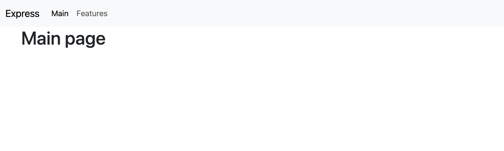
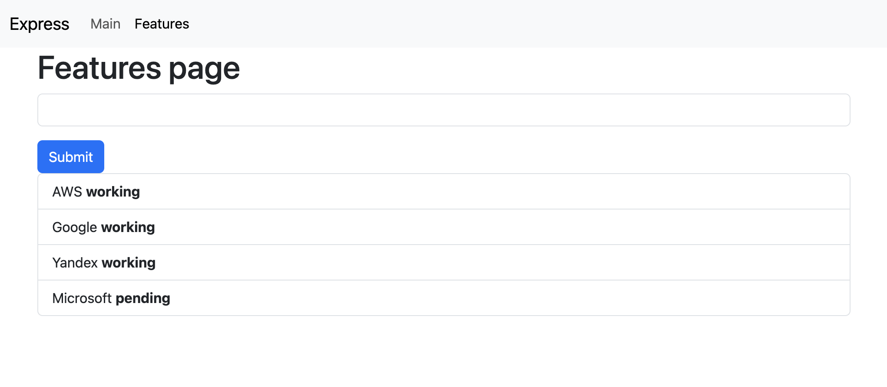
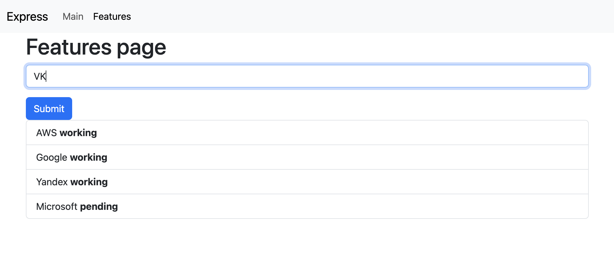
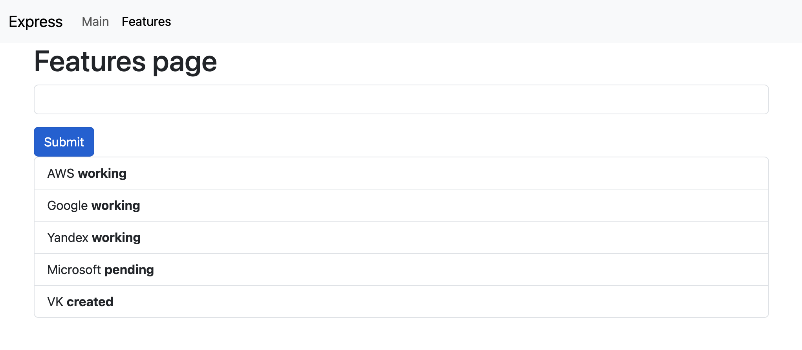
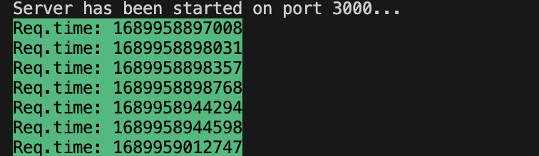

# JS_ExpressJS

### Статический сайт с использованием Express JS и REST API приложение.

#### Для запуска приложения наобходимо выполнить следующие команды в терминале в папке проекта:
- `npm i`
- `npm start`
####  Приложение будет запущено на 3000 порту.

### Page Main

#### *screenshot(1)*

### Page Features

#### *screenshot(2)*

#### *screenshot(4)*

#### *screenshot(4)*

#### Сonsole:

